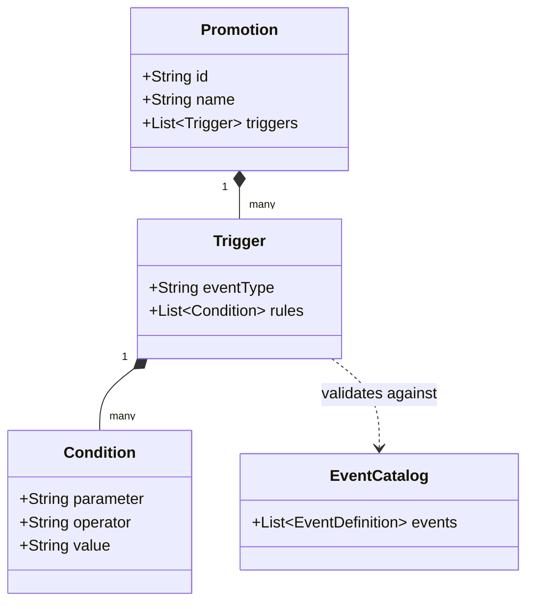
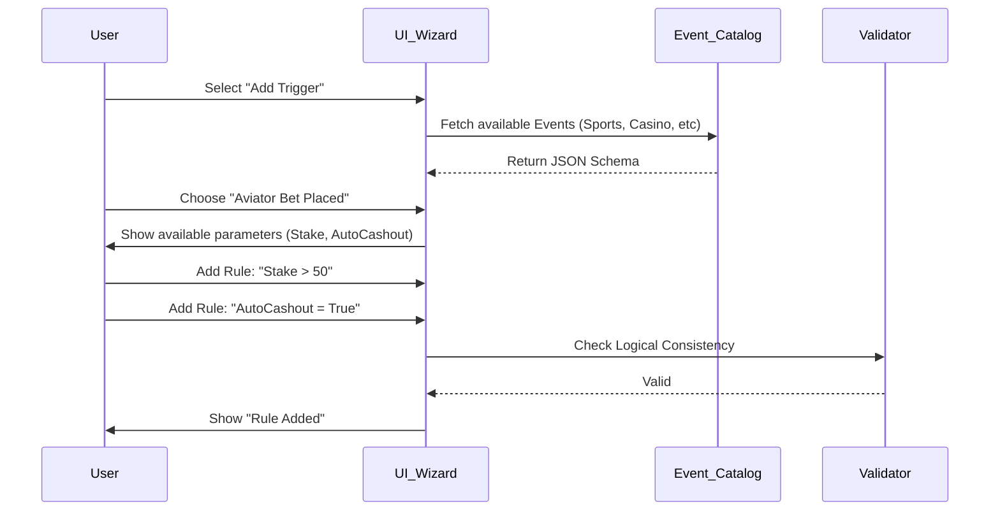

# Product Requirements Document (PRD): Dynamic Eligibility & Qualification Engine

## 0. Executive Summary

### Purpose
To develop a generic, event-driven **Eligibility Engine** that allows business users to define precise qualification criteria for *any* type of promotion. This system abstracts complex real-time event processing (e.g., "Bet Settled", "Game Crashed", "Deposit Made") into a visual rule builder, decoupling marketing creativity from engineering cycles.

### Problem Statement
Currently, determining *who* qualifies for a promotion and *when* requires hardcoded logic (e.g., `if (bet.leg_count > 5)` written in Java/Go). This rigidity makes it impossible to launch novel campaigns (e.g., "Wager on Aviator AND Deposit via Mpesa caused X") without code deployments.

### Proposed Solution
A **Visual Qualification Builder** (Wizard Step 2) where users can:
1.  Select from a standardized **Event Catalog** (Sports, Casino, Wallet).
2.  Chain multiple triggers using **Boolean Logic** (AND/OR).
3.  Define nested conditions on specific event parameters (e.g., `Stake > 100`, `Outcome = Loss`).

### Scope
*   **Included**: Event Catalog definitions, Rule Builder UI, JSON Configuration Schema, Validation Logic.
*   **Excluded**: The downstream Reward Execution (Payouts) or Notification systems.

### Risks & Mitigations
*   **Risk**: Logic Loops (A trigger firing itself).
*   **Mitigation**: Event-Type exclusions (e.g., A "Bonus Awarded" event cannot trigger a "Bonus" promotion).

### Success Criteria
*   Support for cross-vertical qualification (e.g., Sports bet triggers Casino reward).
*   Zero code required to configure a "Mix & Match" rule (e.g., "Bet on EPL OR Bet on NBA").

---

## 1. Context & Background

### Context
This module acts as the "Gatekeeper" of the Promotions Platform. It sits between the **Real-Time Event Stream** (Kafka/RabbitMQ) and the **Reward Engine**. Its sole job is to answer: *"Does this incoming event match the criteria for Promotion X?"*

### Architecture Support
It provides the **Configuration Contract** (JSON) that the backend *Rule Evaluator* utilizes.

---

## 2. Goals & Non-Goals

### 2.1 Goals
*   **Universality**: The system must handle *any* payload structure defined in the Event Catalog (Flat, Nested, Arrays).
*   **Granularity**: Users must be able to target specific fields (e.g., `is_live`, `currency`, `provider`).
*   **Composability**: Support complex logic: `(Trigger A AND Condition X) OR (Trigger B AND Condition Y)`.

### 2.2 Non-Goals
*   **Reward Calculation**: This module determines *if* they qualify, not *what* they get.
*   **Segment Creation**: It uses existing segments (e.g., "VIPs") but does not define how those segments are calculated.

---

## 3. Users & Stakeholders

| User Type | Responsibilities | Needs from Feature | Must Not Do |
| :--- | :--- | :--- | :--- |
| **CRM User** | Configures campaign rules. | Clear Dropdowns, "English-like" rule summary. | Write SQL/Code. |
| **Product Manager** | Defines new Event Types. | Easy way to add new events to the Catalog. | |
| **Data Engineer** | Maps raw events to Catalog. | Strict typing (Float vs Integer) for reliability. | |

---

## 4. High-Level User Journeys & Diagrams

### 4.1 Concept Diagram (UML)



### 4.2 Sequence Flow: Configuration



---

## 5. Functional Requirements (Event & Data Structure)

### 5.1 The Event Catalog Structure
The system must support a strictly typed catalog. Below is the **Standard Event Definition** supported at launch:

#### **A. Sportsbook Events**
| Event ID | Label | Key Parameters |
| :--- | :--- | :--- |
| `bet_placement` | Prematch Bet | `Stake` (float), `Odds` (float), `Selections Count` (int), `Market`, `League` |
| `bet_settled` | Bet Settlement | `Outcome` (Win/Loss/Void), `Profit`, `Payout` |
| `acca_settled` | Accumulator | `Total Legs` (int), `Losing Legs` (int), `Min Odds per Leg` |

#### **B. Aviator & Crash Games**
| Event ID | Label | Key Parameters |
| :--- | :--- | :--- |
| `aviator_bet` | Bet Placed | `Stake`, `Auto Cashout Enabled` (bool), `Target Multiplier` |
| `aviator_crash` | Round Loss | `Stake Lost`, `Crash Point` (float) |
| `aviator_cashout` | Round Win | `Win Amount`, `Cashout Multiplier` |

#### **C. Engagement & Wallet**
| Event ID | Label | Key Parameters |
| :--- | :--- | :--- |
| `deposit` | Deposit | `Amount`, `Method` (Mpesa/Card), `Is First Deposit` (bool) |
| `registration` | Sign Up | `Reg Method`, `Referral Code` |
| `app_install` | App Install | `OS` (Android/iOS) |

### 5.2 Rule Builder Mechanics
*   **REQ-001 (Parameter Mapping)**: When a user selects an event (e.g., `bet_placement`), the UI must *only* show relevant parameters (`Stake`, `Odds`) in the condition dropdown.
*   **REQ-002 (Type Safety)**:
    *   `Boolean` fields (e.g., `Is Live`) must render as Yes/No dropdowns.
    *   `Enum` fields (e.g., `Method`) must render as strict Select lists.
    *   `Numeric` fields must block non-numeric input.

---

## 6. User Interface & High Fidelity Prototype

### 6.1 UI Screen: The Eligibility Wizard
*(Refer to High-Fidelity Prototype - Screen 2.0)*

**Visual Components:**
1.  **Left Panel (Scope)**:
    *   **Markets**: Chip selector for `KE`, `ET`, `GH`, etc.
    *   **Audiences**: Dropdown for segments (`VIP`, `New Users`, `All`).
2.  **Right Panel (The Rule Engine)**:
    *   **Trigger Cards**: Visual blocks representing each "OR" condition.
    *   **Header**: "WHEN [Event Name]" (e.g., `WHEN Accumulator Settled`).
    *   **Condition Rows**: "AND [Parameter] [Operator] [Value]" (e.g., `AND Losing Legs = 1`).
    *   **Action Buttons**: Small icon buttons for `Add Condition (+)`, `Delete Rule (Trash)`.
3.  **Modal Overlay**:
    *   **Event Picker**: A grid of categories (Sports, Casino, etc.) to select the primary trigger.

### 6.2 Prototype Interaction States
*   **Empty State**: "No Triggers Configured. Click (+) to add an event."
*   **Populated State**: List of rule cards connected by "OR" dividers.
*   **Error State**: Red outline on input fields if validation fails (e.g., negative stake).

---

## 7. Data Models (JSON Schema)

### 7.1 Configuration Payload
This is the artifact generated by the wizard, stored in the DB, and read by the Backend Engine.

```json
{
  "eligibility_config": {
    "segments": ["VIP_TIER_1", "VIP_TIER_2"],
    "markets": ["ET"],
    "triggers": [
      {
        "id": "trigger_001",
        "event_type": "acca_bet_settled",
        "logic_gate": "AND",
        "conditions": [
          { "param": "total_legs", "operator": "gte", "value": 6 },
          { "param": "losing_legs", "operator": "eq", "value": 1 },
          { "param": "min_odds_per_leg", "operator": "gte", "value": 1.2 }
        ]
      },
      {
        "id": "trigger_002",
        "event_type": "aviator_cashout",
        "logic_gate": "AND",
        "conditions": [
          { "param": "multiplier", "operator": "gte", "value": 50.0 },
          { "param": "stake", "operator": "gte", "value": 100 }
        ]
      }
    ]
  }
}
```

---

## 8. Requirements Matrix

| ID | Requirement | Priority | QA Validation |
| :--- | :--- | :--- | :--- |
| **EL-01** | System supports selecting multiple triggers (OR logic). | P0 | Can I add a Sports trigger AND a Casino trigger in one promo? |
| **EL-02** | System enforces parameter data types. | P0 | Does the input block text for "Stake Amount"? |
| **EL-03** | Condition operators adapt to types (e.g., no ">" for strings). | P1 | Do String fields only show "Equals/Contains"? |
| **EL-04** | Draft state allows saving incomplete rules. | P2 | Can I save a rule with a blank value to finish later? |

---

## 9. Rollout & Compatibility

*   **Versioning**: The Event Catalog must be versioned (`v1`, `v2`). Promotions lock to the catalog version active at creation time.
*   **Deprecation**: If an event type (e.g., `Virtuals_Old`) is deprecated, existing promotions continue to run, but new ones cannot select it.
