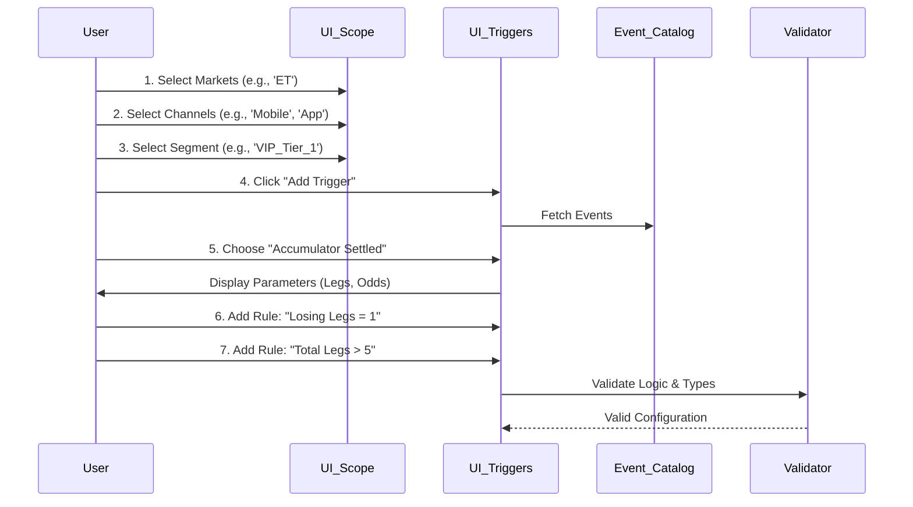

# Product Requirements Document (PRD): Dynamic Eligibility & Qualification Engine

## 0. Executive Summary

### Purpose
To develop a generic, event-driven **Eligibility Engine** that allows business users to define precise qualification criteria for *any* type of promotion. This system abstracts complex real-time event processing (e.g., "Bet Settled", "Game Crashed", "Deposit Made") into a visual rule builder, decoupling marketing creativity from engineering cycles.

### Problem Statement
Currently, determining *who* qualifies for a promotion and *when* requires hardcoded logic (e.g., `if (bet.leg_count > 5)` written in Java/Go). This rigidity makes it impossible to launch novel campaigns (e.g., "Wager on Aviator AND Deposit via Mpesa caused X") without code deployments.

### Proposed Solution
A **Visual Qualification Builder** (Wizard Step 2) where users can:
1.  **Target**: Define scope via Markets, Channels, and Player Segments.
2.  **Trigger**: Select from a categorized **Event Catalog** (Sports, Casino, Wallet).
3.  **Qualify**: Chain multiple triggers and nested conditions using **Boolean Logic**.

### Success Criteria
*   Support for cross-vertical qualification (e.g., Sports bet triggers Casino reward).
*   Zero code required to configure a "Mix & Match" rule (e.g., "Bet on EPL OR Bet on NBA").

---

## 2. Architecture & Diagrams

### 2.1 Use Case Diagram (Actor Interactions)

```mermaid
usecaseDiagram
    actor "CRM Manager" as CRM
    actor "Compliance Officer" as COMP
    actor "Promotion Engine" as SYS

    package "Eligibility Wizard" {
        usecase "Define Target Audience" as UC1
        usecase "Select Trigger Event" as UC2
        usecase "Configure Logic Rules" as UC3
        usecase "Simulate Eligibility" as UC4
    }

    CRM --> UC1
    CRM --> UC2
    CRM --> UC3
    CRM --> UC4

    UC1 ..> "Select Market (KE/ET)" : include
    UC1 ..> "Select Channel (App/Web)" : include
    UC1 ..> "Select Segment (VIP/New)" : include

    UC3 ..> "Add Condition (AND)" : include
    UC3 ..> "Add Group (OR)" : include

    COMP --> UC4 : verifies
    SYS --> UC3 : consumes configuration
```

### 2.2 Sequence Diagram: End-to-End Configuration



---

## 3. The Event Logic Data Table

The system must support specific data types and operators for every parameter.

| Category | Event Name | Parameter | Data Type | Supported Operators | Sample Values |
| :--- | :--- | :--- | :--- | :--- | :--- |
| **Sports** | `bet_placement` | `Stake` | Float | `>`, `<`, `=`, `>=` | `50.00`, `100` |
| | | `Sport` | Enum | `=`, `!=`, `IN` | `'Football'`, `'Tennis'` |
| | | `Is Live` | Boolean | `=` | `True` (Yes), `False` (No) |
| | `acca_settled` | `Total Legs` | Integer | `>`, `<`, `=` | `5`, `10` |
| | | `Losing Legs` | Integer | `=` | `1` (One Cut) |
| | | `Outcome` | Enum | `=` | `'Win'`, `'Loss'`, `'One-Cut'` |
| **Aviator** | `aviator_bet` | `Auto Cashout` | Boolean | `=` | `True` |
| | `aviator_crash` | `Crash Point` | Float | `<`, `>` | `1.20x`, `5.00x` |
| **Wallet** | `deposit` | `Method` | Enum | `=`, `IN` | `'Mpesa'`, `'Card'`, `'Airtel'` |
| | | `Is First Dep` | Boolean | `=` | `True` |
| **User** | `login` | `Days Inactive`| Integer | `>` | `30`, `90` |
| | `registration` | `Reg Method` | Enum | `=` | `'SMS'`, `'Web'` |

---

## 4. User Interface Specification

Based on the implemented design, the UI consists of a **Split-Screen Layout** to separate "Scope" from "Logic".

### Screen 1: The Wrapper
*   **Stepper**: A localized top navigation showing progress (Basics > **Eligibility** > Rewards > Schedule).
*   **Header**: Contextual title ("Targeting & Triggers") with a "Draft Mode" badge.

### Screen 2: The Core Builder (Split Layout)

#### **Left Panel: Scope & Target**
*   **Purpose**: Define the "Who" and "Where".
*   **Components**:
    *   **Market Selector**: Multi-select chips. Selection filters available payment methods in the trigger engine (e.g., Selecting 'KE' shows 'Mpesa').
    *   **Channel Toggles**: Buttons for `Web`, `App`, `SMS`, `USSD`. Used to include/exclude platforms.
    *   **Segment Dropdown**: A robust select input pulling live segments (e.g., "Churned < 30 days").

#### **Right Panel: Qualification Rules**
*   **Purpose**: Define the "What" and "When".
*   **Components**:
    *   **Trigger Card**: A container representing a single logical Group (AND logic inside).
    *   **Event Badge**: Distinct color coding (Yellow for Sports, Cyan for Wallet) showing the Event Name (e.g., `WHEN: Deposit`).
    *   **Condition Row**:
        *   **Parameter**: Dropdown (e.g., "Amount").
        *   **Operator**: Smart dropdown (e.g., ">=").
        *   **Value**: Input field with type validation (Number only for amounts).
    *   **Logical Connectors**: Visual "OR" dividers between Trigger Cards.

---

## 5. High Fidelity Prototype Description
*(See generated artifact for visual reference)*

**Visual Style:**
*   **Theme**: Dark Mode (Financial/Terminal aesthetic).
*   **Colors**: background `#0f111a`, accents `#06b6d4` (Cyan) and `#facc15` (Yellow).
*   **Glassmorphism**: Panels use semi-transparent backgrounds with subtle borders (`1px solid rgba(255,255,255,0.1)`).

**Key Interactions:**
*   **Adding Triggers**: A large "Add Trigger" button opens a modal grid of Event Categories.
*   **Deleting Rules**: Hovering a row follows a "Trash" icon for quick removal.
*   **Navigation**: "Next Step" button stays fixed at the bottom right.

---

## 6. Functional Requirements Matrix

| ID | Requirement | User Story | Priority |
| :--- | :--- | :--- | :--- |
| **UI-01** | **Market Isolation** | As a user, I select "KE" so that rules only apply to Kenya. | P0 |
| **UI-02** | **Channel Filtering** | As a user, I select "App Only" to drive app installs. | P1 |
| **LG-01** | **Multi-Trigger** | As a user, I want "Bet on EPL" OR "Bet on La Liga" to count. | P0 |
| **LG-02** | **Nested Logic** | As a user, I want "Bet > 100 AND Odds > 1.5" to be one rule. | P0 |
| **DT-01** | **Enum Validation** | The system must list specific outcomes (Win/Loss) for consistency. | P0 |
