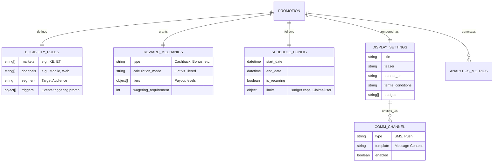
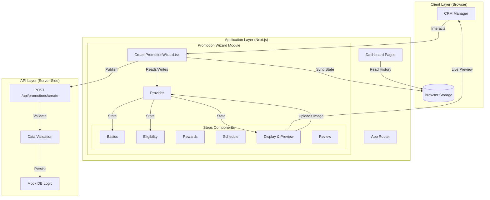

# System Architecture & Conceptual Model

## 1. Conceptual Data Model

This diagram illustrates the core entities involved in the Promotion Engine and their relationships. It represents how a **Promotion** is composed of modular configurations for eligibility, rewards, scheduling, and presentation.

## 2. Technical Architecture

This diagram details the application structure, highlighting the separation between the User Interface (Next.js), State Management (React Context), and the Data/API Layer.

### Component Breakdown

1.  **WizardContext (State Container)**:
    *   Acts as the single source of truth for the promotion being created.
    *   Manages nested state objects (`basics`, `eligibility`, `rewards`, `schedule`, `display`).
    *   Provides updater functions to step components.

2.  **Step Components**:
    *   **Isolated Logic**: Each step handles its own validation and UI logic (e.g., `Step6Display` handles image previews internally before updating Global State).
    *   **Step6Display (Dual Preview)**: Contains logic to render both Mobile and Web visualizations in real-time based on the Context data.

3.  **Data Persistence**:
    *   **Transitory**: `WizardContext` holds data while editing.
    *   **Persistent (Prototype)**: `LocalStorage` ('saved_promotions') acts as the client-side database to persist created promotions across reloads.
    *   **Backend (Mock)**: The API route simulates a server transaction, enforcing delays and basic validation to mimic a real production environment.
